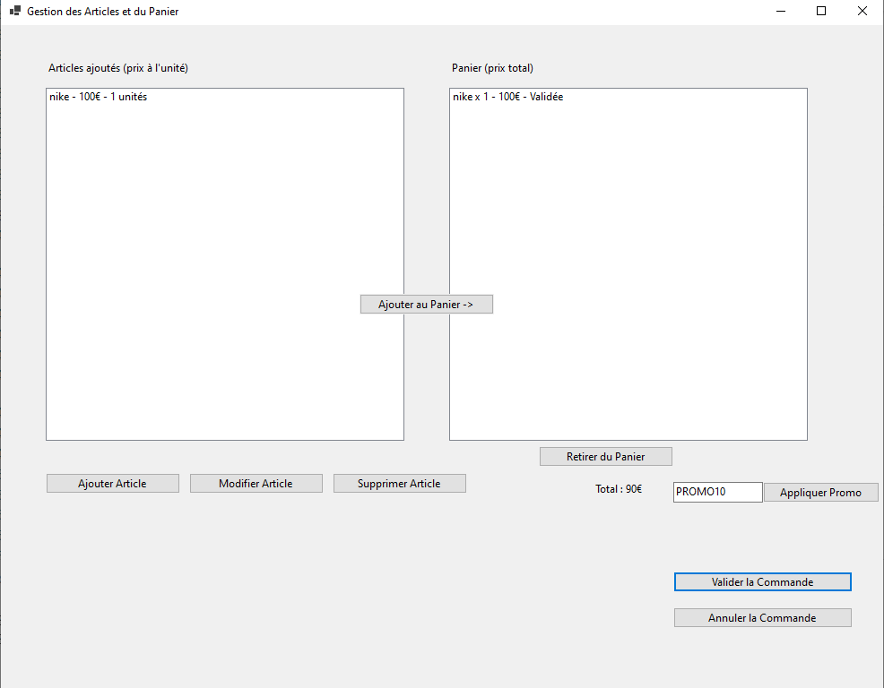

- Projet de Gestion de Magasin en C# (avec WinForms)
NB : pour les US 9, 10, 11 et 12 il n'y a pas de commits appropriés, car ça représente l'IHM... 
- Commandes pour lancer le projet : dotnet build suivi de dotnet run
- Voici quelques captures de l'interface de l'US1 : Gestion des articles
     
     

- Interface de l'US 2 : Gestion du panier

     

- Interface à l'étape de l'US 6 :

     

- Interface à l'étape de l'US 7  de promo :

     