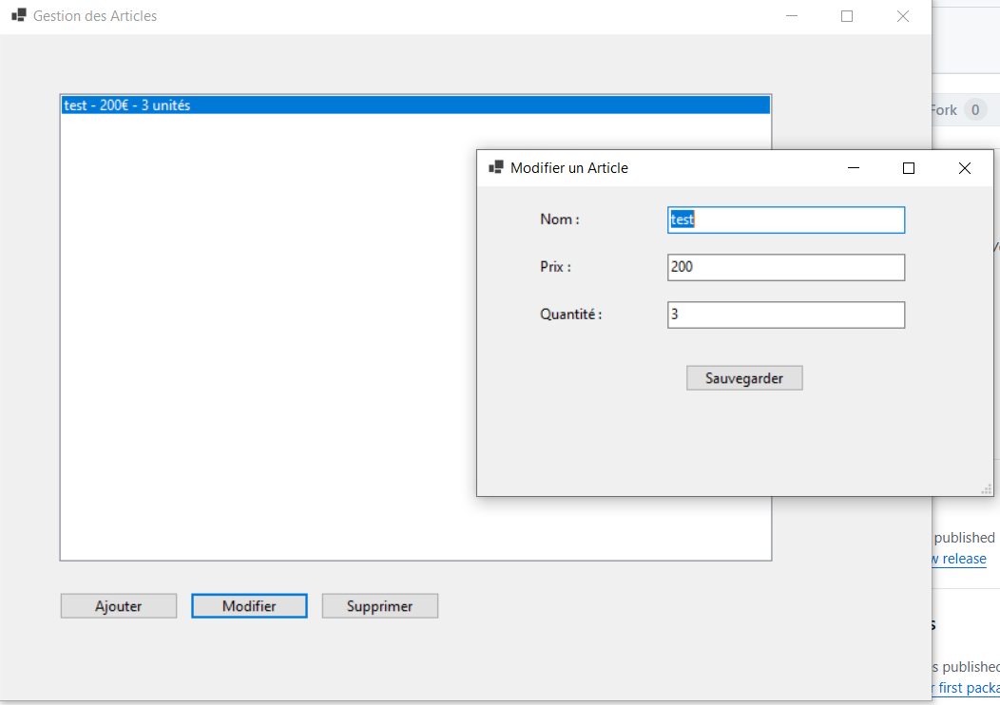

- Projet de Gestion de Magasin en C# (avec WinForms)
- Commandes pour lancer le projet : dotnet build suivi de dotnet run
- Voici quelques captures de l'interface de l'US1 : Gestion des articles
     
     

- Interface de l'US 2 : Gestion du panier

     

